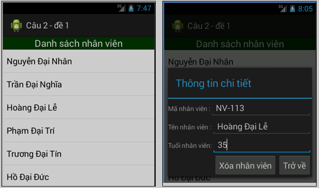

# Android_Studio_TestFinal
Viết chương trình quản lý nhân viên bằng SQLite
Thông tin của nhân viên bao gồm: Mã, tên và tuổi; tất cả các nhân viên được lưu trữ bằng hệ cơ sở dữ liệu SQLite, hãy thiết kế giao diện và thực hiện các yêu cầu như dưới đây: 
